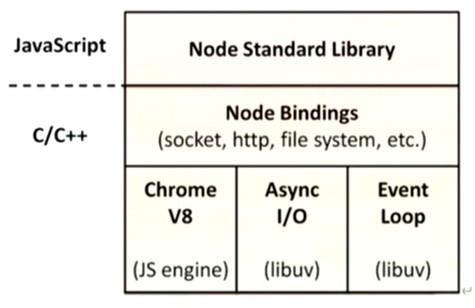
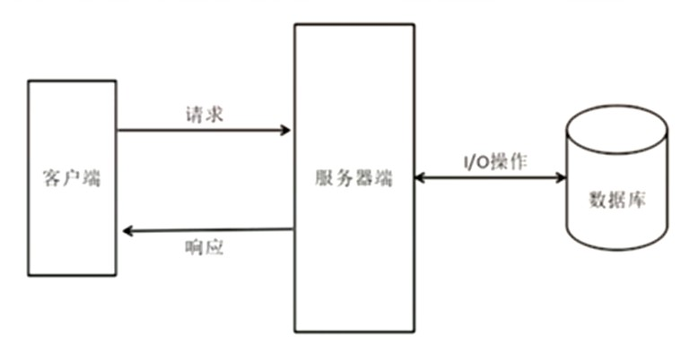

# Node.js 课程

## 第一章 Node.js

### 1.1 Node.js诞生史

Node.js之父：Ryan Dahl（瑞安·达尔）
Node.js诞生时间：2009年

- Ryan Dahl并非科班出身的开发者，在2004年在纽约的罗彻斯特大学数学系读博士。
- 2006年退学，来到智利的 Valparaiso小镇。
- 期问曾熬夜做了一些不切实际的研究，例如如何通过云进行通信。
- 偶然的机会，走上了编程之路，生活方式变为接项目，然后去客户的地方工作。
- 工作中遇到了主流服务器的瓶颈问题，尝试着自己去解决，费尽周折没有办法。
- 2008年 Google公司 Chrome V8引擎橫空出世， JavaScript脚本语言的执行效率得到质的提升，他的想法与 Chrome v8引擎碰撞出激烈的火花。
- 2009年的2月，按新的想法他提交了项目的第一行代码，这个项目的名字最终被定
名为“node”。
- 2009年5月，正式向外界宣布他做的这个项目。
- 2009年底， Ryan Dahl在柏林举行的 JSConf EU会议上发表关于 Node. js的演讲，之后Node.js逐渐流行于世。
- Ryan Dah于2010年加入 Joyent公司，全职负责 Node. js项目的开发。此时 Node. js项目己经从个人项目变成一个公司组织下的项目

### 1.2 Node.js是什么？

Node.js是一个基于ChromeV8 引擎的 JavaScript 运行环境。



大白话：用JS代码编写一个服务器，运行在node.js这个平台上，可以操作文件。

### 1.3 Node.js有什么特点

1. 优点

  - 异步非阻塞的I/O（I/O线程池）

  - 特别适用于**I/O密集型**应用

  - 事件循环机制

  - 单线程（成也单线程，败也单线程）

  - 跨平台

简单的web交互模型：




2. 不足之处

  - 回调函数嵌套太多、太深（俗称回调地狱）
  
  - 单线程，**处理不好CPU密集型任务**


3. 大白话解释：

  - I/O: input（写），output（读），即数据库的读写操作

  - I/O密集型：频繁操作I/O


### 1.4 Node中函数的特点

1. Node中任何一个模块（js文件）都被一个外层函数所包裹
  ```
  js
  function (exports, require, module, __filename, __dirname) {}
  ```

  - exports, require, module => 用于支持CommonJs模块化规范的暴露、引入语法

  - __filename => 当前运行文件的绝对路径

  - __dirname =>  当前运行文件所在文件夹的绝对路径

2. 为什么要设计这个外层函数？

  1 用于支持模块儿化语法

  2 隐藏服务器内部实现（从作用域角度去看）

### 1.5 Node中的global

1. 浏览器端，js由哪几部分组成？

  - BOM -> window浏览器对象模型 -> 很多API（location，history）

  - DOM ->  document文档对象模型 -> 很多API（对DOM的增删改查）

  - ES规范 -> ES5,ES6

2. Node端，js由哪几部分组成？

  - 没有了BOM -> 因为服务器不需要（服务器没有浏览器对象）
  
  - 没有了DOM -> 因为没有浏览器窗口

  - 几乎包含了所有的ES规范

  - 没有了window，但是取而代之的是一个叫global的全局变量

  （Node中禁止函数的this指向global，而是指向了一个空对象。）
  console.log(this)
  console.log(global)

  ```
  js
  <ref *1> Object [global] {
    global: [Circular *1],
    clearInterval: [Function: clearInterval],
    clearTimeout: [Function: clearTimeout],
    setInterval: [Function: setInterval],
    setTimeout: [Function: setTimeout] {
      [Symbol(nodejs.util.promisify.custom)]: [Getter]
    },
    queueMicrotask: [Function: queueMicrotask],
    clearImmediate: [Function: clearImmediate],
    setImmediate: [Function: setImmediate] {
      [Symbol(nodejs.util.promisify.custom)]: [Getter]
    }
  }
  ```


### 1.6 Node中的事件循环机制

**第一个阶段： timer**
[ 定时器阶段 - setTimeout,setInterval ]

  1. 开始计时
  
  2. 执行定时器的回调

**第二个阶段： pending callbacks**
[ 系统阶段 ]

**第三个阶段： idle,prepare**
[ 准备阶段 ]

**第四个阶段： poll**
[ 轮询阶段，核心 ]
  1. 如果回调队列里有待执行的回调函数：

      从回调队列中取出回调函数，同步执行（一个个执行），直到回调队列为空s或到达系统最大限度

  2. 如果回调队列为空：

      2.1 若有设置过setImmediate，进入下一个check阶段（目的：为了执行setImmediate的回调）

      2.2 若未设置过setImmediate
      
        	2.2.1 在此阶段停留，等待回调函数被插入回调队列
        	2.2.2 若定时器到点了，进入下一个check阶段，（目的：走五、六阶段，随后走第一阶段）

**第五个阶段： check**
[ 专门用于执行setImmediate所设置的回调 ]

**第六个阶段： close callbacks**
[ 关闭回调阶段 ]


**注意：**`process.nextTick()`  用于设置立即执行函数（“氪金玩家”-任意阶段优先执行，除了主线程）


```

   ┌───────────────────────────┐
┌─>│           timers          │
│  └─────────────┬─────────────┘
│  ┌─────────────┴─────────────┐
│  │     pending callbacks     │
│  └─────────────┬─────────────┘
│  ┌─────────────┴─────────────┐
│  │       idle, prepare       │
│  └─────────────┬─────────────┘      ┌───────────────┐
│  ┌─────────────┴─────────────┐      │   incoming:   │
│  │           poll            │<─────┤  connections, │
│  └─────────────┬─────────────┘      │   data, etc.  │
│  ┌─────────────┴─────────────┐      └───────────────┘
│  │           check           │
│  └─────────────┬─────────────┘
│  ┌─────────────┴─────────────┐
└──┤      close callbacks      │
   └───────────────────────────┘
```


## 第二章 包和包管理器

### 2.1 package包

Node.js的包基本遵循CommonJS规范，包将一组相关的模块组合在一起，形成一组完整的工具。

包由包结构和包描述文件两个部分组成。

1. 包结构：用于组织包中的各种文件

2. 包描述文件：描述包的相关信息，以供外部读取分析

#### 2.1.1 包结构

包实际上就是一个压缩文件，解压以后还原为原目录。符合CommonJS规范的目录，应该包含如下文件和文件夹：

1. package.json 描述文件

2. bin 可执行二进制文件

3. lib js代码

4. doc 文档

5. test 单元测试

### 2.2 npm常用命令

**一、安装:**（安装之前必须保证文件来内有 package.json，且里面的内容格式合法）

1. `npm install XXXXX -save`或 `npm i XXXX -S` 或 `npm i XXXX`

    备注:

    1）.局部安装完的第三方包，放在当前月录中 node_modules这个文件里

    2）.安装完会自动产生一个 package-lock.json（npm5以后才有），里p面缓存的是每个下我过的包的地址，目的是下次安装更快

    3）.当安装完一个包，该包的名字会自动写入到 package.json中的 dependencies（生产依赖）里。

2. `npm install XXXXX--save-dev` 或 `npm i XXXXX -D` 安装包并将该包写入到devDependencies（开发依赖中）

    备注:什么是生产依赖与开发依赖？

    1.只在开发的（写代码时）用到的库，就是开发依赖

    例如:语法检查、压缩代码、扩展CSS前缀的包

    2.在生产环境中（项目上线）不可缺少的，就是生产依赖

    例如: Jquery、 bootstrap等等。

    3.注意:某些包即属于开发依救，又属于生产依赖

    例如:Jquery

3. `npm i XXXX -g` 全局安装xxxx包（一般来说，带有指令集的包要进行全局安装，例如: browserify、 babel等

查看全局安装的位置: `npm root -g`

4. `npm i xxx@yyy` : 安装x包的yy版

5. `npm i` :安装 package.，json中声明的所有包

**二、移除**

`npm uninstall xxxx` 在node_module中删除xxx包，同时会删除该包在package.json中的声明

**三、其他命令**
1. `npm aduit fix`：检测项目依赖中的一些问题，并且尝试着修复

2. `npm view xxxxx versions`：查看远程npm仓库中xxxx包的所有版本信息

3. `npm view xxxxx version`：查有npm仓库中xxxx包的最新版本

4. `npm ls xxxx`：看我们所安装的xxxx包的版饭本

**四、关于版本号的说明**
"^3.x.x"：锁定大版本，以后安装包的时候，保证包是3.x.x版本，x默认取最新的。
"~3.1.x"：锁定小版本，以后安装包的时候，保证包必须是3.1.x版本，x默认取最新的。
"3.1.1"：锁定完整版木，以后安装包的时候，保证包必须是3.1.1版本。


### 2.3 yarn常用命令

yan使用本地缓存，有时甚至无需互联网连接就能安装本地已经缓存过的依赖项，安装方法: 

`npm install- g yarn`

特别注意！

由于yarn的全局安装位置与npm不同，所以要配置yarn的全局安装路径刭环境变量中，否则全局安装的包不起作用,具体操作如下

安装yaen后分别执行`yarn global dir`命令， `yarn global bin`命令。

将上述两步返回的路径配置到电脑环境变量中即可。

**yarn命令与npm命令的对应关系如下:**

初始化项目:
```powershell
yarn init -y
npm init
```

下载项目的所有声明的依赖
```powershell
yarn
npm install
```

下载指定的运行时依赖包:
```powershell
yarn add xxx×@3.2.1
npm install xxxx@3.2.l -S
```

下载指定的开发时依赖:
```powershell
yarn add xxx×@3.2.1 -D
npm install xxxx@3.2.l -D
```

全局下载指定包:
```powershell
yarn global add xxxx
npm install xxxx -g
```

删除依赖包:
```powershell
yarn remove xxxx
yarn global remove xxxx
npm uninstall xxxx -g
```

查看某个包的信息:
```powershell
yarn info xxx
npm Info xxx
```

设置淘宝镜像:
```powershell
yarn config set registry https://registry.npmtaobao.org
npm config set registry https://registry.npmtaobao.org
```

## 第三章 Buffer缓冲器

### 3.1 Buffer是什么

Buffer是一个和数组类似的对象，不同的是Buffer是专门用来保存二进制数据的。


### 3.2 Buffer的特点

1. 效率很高，存储和读取速度很快，它直接对计算机的内存进行操作。

2. 大小固定，一旦确定不能修改。

3. 每个元素占用内存的大小为**1字节**。
  
    - 进制相关：
    
      十六进制：00 --- ff
      二进制：00000000 --- 11111111 (8位)

      8位(bit) = 1字节(byte)

4. Buffer是Node中的非常核心的模块，无需下载、无需引入，直接使用


### 3.3 Buffer的使用

1. 创建一个Buffer的对象实例 --- 性能特别差 --- 1.在堆里开辟空间 2.清理
    ```js
    let buf = new Buffer(10)
    console.log(buf); //<Buffer 00 00 00 00 00 00 00 00 00 00>
    ```


2. `Buffer.alloc()` --- 性能比new Buffer()强一点 --- 在堆里开辟一块儿空间（无人用过）
    ```js
    let buf2 = Buffer.alloc(10)
    console.log(buf2)
    ```


3. `Buffer.allocUnsafe() `--- 性能最好 --- 
    1. 输出结果：输出的是16进制，存储的是二进制，输出的时候会自动转16进制
    2. 在堆里开辟空间，可能残留着别人用过的数据，因此allocUnsafe
    ```js
    let buf3 = Buffer.allocUnsafe(10)
    console.log(buf3) // <Buffer 30 e5 2a aa 3c 01 00 00 c0 78> 随机的
    ```


4. `Buffer.from()`
   
    1. 输出的为啥不是字符串？因为用户存储的不一定是字符串，也可能是媒体文件
    2. 如何把输出转为我们认识的？`toString()`
    ```js
    let buf4 = Buffer.from("hello atguigu")
    console.log(buf4); // <Buffer 68 65 6c 6c 6f 20 61 74 67 75 69 67 75>
    console.log(buf4.toString()); // hello atguigu
    ```

## 第四章 Node中的文件操作

Node中的文件系统：

 1. 在NodeJS中有一个文件系统，所谓的文件系统，就是对着计算机中的文件进行增删改查等操作。

 2. 在NodeJS中给我们提供了一个模块，叫做**fs模块（文件系统）**，专门用于操作文件。

 3. fs模块是Node的核心模块，使用的时候，无需下载，直接引入。


### 4.1 文件写入

#### 4.1.1 简单文件写入

异步文件写入（简单文件写入）

 **fs.writeFile(file, data[, options], callback)**

 - file <string> | <Buffer> | <URL> | <integer> 要写的文件路径+文件名
 - data <string> | <Buffer> | <TypedArray> | <DataView> | <Object> 要写入的数据
 - options **<Object>** | <string> 配置对象（可选参数）

    - encoding <string> | <null> 设置文件的编码方式，默认“utf8”
    - mode <integer> 设置文件操作权限（8进制），默认值： 0o666
      - 0o111：文件可被执行的权限    *.exe*  *.msc*  几乎不用
      - 0o222：文件可被写入的权限
      - 0o444：文件可被读取的权限
      - 0o666 = 0o222 + 0o444
    - flag <string> 打开文件要执行的操作，默认值“w”
      - a：追加
      - w：写入
    - signal <AbortSignal> allows aborting an in-progress writeFile
 - callback <Function>  回调函数
    - err <Error> | <AggregateError> 错误参数
 - Node中有一个原则：错误优先


基本使用方法：
```js
// 引入内置的fs模块
let fs = require('fs')

// 调入writeFile方法
fs.writeFile("./demo.txt","耶斯莫拉",(err)=>{
  if(err){
    console.log("文件写入失败",err)
  }else{
    console.log("文件写入成功")
  }
})
```

修改options，追加数据：
```js
// 引入内置的fs模块
let fs = require('fs')

fs.writeFile(__dirname+"/demo.txt","郭语永远年轻！",{mode:0o666, flag:'a'},(err)=>{
  if(err){
    console.log("文件写入失败",err)
  }else{
    console.log("文件写入成功")
  }
})
```
- `__dirname` 表示当前文件所在文件夹路径

#### 4.1.2 流式文件写入

 **fs.createWriteStream(path[, options])**

 - path <string> | <Buffer> | <URL>  文件路径+文件名
 - options <string> | <Object>  配置对象
    - flags <string> 打开文件要执行的操作，默认值“w” 
      - “r+”：替换
      - “a”：追加
    - encoding <string> 设置文件的编码方式，默认“utf8”
    - fd <integer> | <FileHandle> 文件唯一标识符（Linux），默认值: null
    - mode <integer>设置文件操作权限（8进制），默认值： 0o666
    - autoClose <boolean> 自动关闭文件，默认值: true
    - emitClose <boolean> 自动发射关闭命令: true
    - start <integer>从第N位开始操作，填整数
    - fs <Object> | <null> Default: null
 - Returns: <fs.WriteStream>

```js
let fs = require('fs')

// 创建一个可写流
let ws = fs.createWriteStream(__dirname+'/demo2.txt',{start:11,flags:"r+"})

//只要用到流，就必须监测流的状态，否则会导致内存溢出
ws.on('open',function(){
  console.log('打开');
})
ws.on('close',function(){
  console.log('关掉');
})

//使用可写流写入大数据
ws.write('22\n') 
ws.write('22\n') 
ws.close()
```


### 4.2 文件读取

#### 4.2.1 简单文件读取

 **fs.readFile(path[, options], callback)**

 - path <string> | <Buffer> | <URL> | <integer> 文件路径和文件名
  - options <Object> | <string> 配置对象
      - encoding <string> | <null> Default: null
      - flag <string> See support of file system flags. Default: 'r'.
      - signal <AbortSignal> allows aborting an in-progress readFile
  - callback <Function> 回调
      - err <Error> | <AggregateError> 错误对象
      - data <string> | <Buffer></Buffer> 读出来的数据

```js
let fs = require('fs')

fs.readFile(__dirname+'/demo.txt',function(err,data){
  if(err) console.log(err)
  else console.log(data) // <Buffer 68 65 6c 6c 6f 21 21 21 21 21 21>
  fs.writeFile('./haha.txt',data,function(err){
    if(err) console.log(err)
    else console.log('写入成功！')
  })
})
```
注意：输出的是Buffer，因为读取的内容可以是视频、图片等各种数据类型。

注意：简单文件写入和简单文件读取，都是一次性把所有要读取或要写入的内容加到内存中，容易造成内存泄露。

#### 4.2.1 流式文件读取

**fs.createReadStream(path[, options])**

- path <string> | <Buffer> | <URL> 要读取的文件路径和文件名
- options <string> | <Object>配置对象
    - flags <string>  Default: 'r'.
    - encoding <string> Default: null
    - fd <integer> | <FileHandle> Default: null
    - mode <integer> Default: 0o666
    - autoClose <boolean> Default: true
    - emitClose <boolean> Default: true
    - start <integer> 起始偏移量
    - end <integer> 结束偏移量: Infinity
    - **highWaterMark** <integer> 每次读取数据的大小，默认值: 64 * 1024
    - fs <Object> | <null> Default: null

流式文件读取并写入新文件：
```js

let {createReadStream, createWriteStream} = require('fs')

//创建一个可读流

let rs = createReadStream(__dirname+'/demo.txt',{
  highWaterMark:10 * 1024 * 1024  // 这个配置用的最多
})

let ws = createWriteStream('./haha.txt')

rs.on('open',function(){
  console.log('可读流打开');
})
rs.on('close',function(){
  console.log('可读流关掉');
  ws.close()
})
ws.on('open',function(){
  console.log('可写流打开');
})
ws.on('close',function(){
  console.log('可写流关掉');
})

// 给可读流绑定一个data事件，就会触发可读自动读取内容

rs.on('data',function(data){
  console.log(data.toString());
  // Buffer实例的length属性，是表示该Buffer实例占用内存空间的大小
  console.log(data.length);
  ws.write(data)
  // ws.close() // 若在此处关闭流，会写入一次，如果数据较大，后续数据会丢失
})
// ws.close() // 若在此处关闭流，导致无法写入数据

```


# 数据库课程

## 第一章 数据库

### 1.1 数据库是什么

数据库（DataBase）是按照数据结构来组织、存储和管理数据的仓库。

### 1.2 为什么要使用数据库

我们的程序都是在内存中运行的，一旦程序运行结束或者计算机断电，程序运行中的数据都会丢失。所以我们就需要将一些程序运行的数据持久化到硬盘中，以确保数据的安全性。而数据库就是数据**持久化**的最佳选择。说白了，数据库就是存储数据的仓库。

### 1.3 数据库的分类

#### 1.3.1 关系型数据库（RDBS）

SQL：Structured Query Language，结构化查询语言。

代表有：MySQL、Oracle、DB2、SQL Server...

特点：关系紧密，都是表


优点：

1. 易于维护：都是使用表结构，格式一致
2. 使用方便：**SQL通用**，可以用于复杂查询
3. 高级查询：可用于一个表以及多个表之间非常复杂的查询。

缺点：

1. 独写性能比较差，尤其是海量数据的高效率独写
2. 有固定的表结构，字段不可随意更改，灵活度稍微欠缺
3. 高并发读写需求，传统关系型数据库来说，硬盘I/O是一个很大的瓶颈

对于关系型数据库：

- Excel文件 --> 数据库 
- sheet文件 --> 表
- 列	头	  --> 字段（唯一标识，不允许修改；主键）
- 一	行	  --> 一条数据


#### 1.3.1 非关系型数据库（NoSQL）

代表有：MongoDB、Redis...

特点：关系不紧密，有文档，有键值对


优点：

1. 格式灵活：存储数据的格式可以是Key，value形式
2. 速度快：NoSQL可以内存作为载体，而关系型数据库只能使用硬盘
3. 安装与配置简单：NoSQL数据库部署简单

缺点：

1. 不支持sql，学习和使用成本较高
2. **不支持事务**
3. 复杂查询时语句过于繁琐


关于MongoDB：

- MongoDB是为快速开发互联网Web应用而设计的数据库系统。

- MongoDB的设计目标是极简、灵活、作为Web应用栈的一鄰分。

- MongoDB的数据模型是面向文档的，所谓文档是一种类似于json的结构，简单理解

- MongoDB这个数据库中存的是各种各样的json。（BSON）
